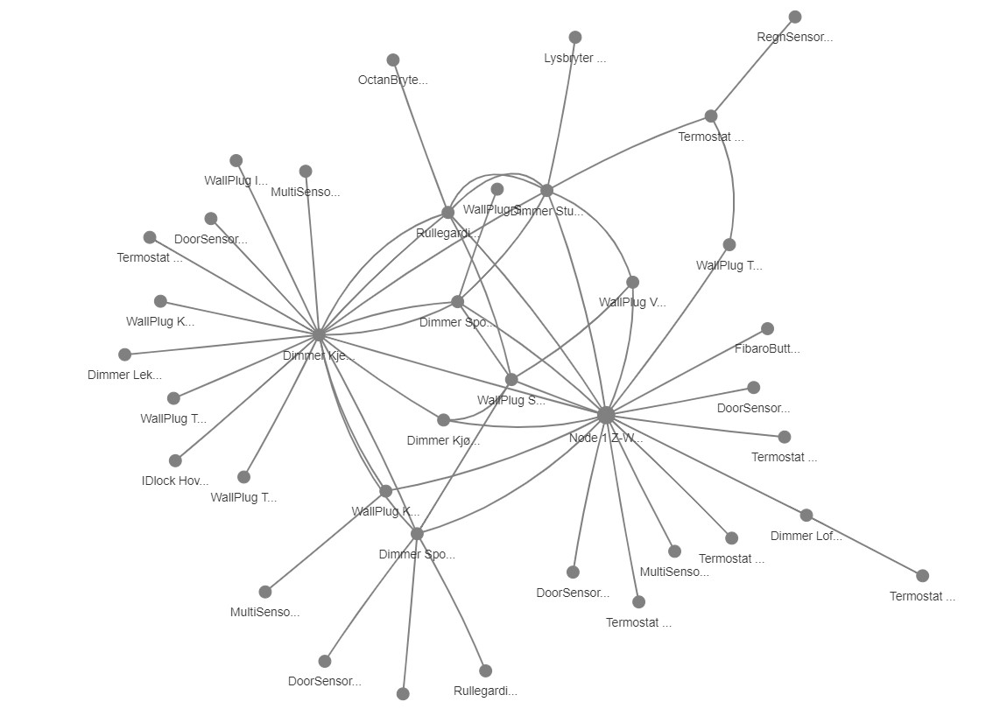

[](https://www.python.org)


[](https://zwiz-hs3.readthedocs.io/en/latest/)

## zwiz-hs3
Zwiz is a hobby-project graphing my Z-wave network. It is made for visualizing a Z-wave network set up through Homeseer 3 on a UZB1 stick, but could probably be easily adapted to visualize other networks.

The visualisation is done using the fantastic [Dash by Plotly](https://plotly.com/python/).

Built for personal usage in a very controlled environment. This package must be considered not-maintained. 

## Installation and usage
```
git clone <this repo>
pip install <local repo>
python app.py <ip adress to HS3> <port>
```

The app will start the Dash server on localhost and set up a website showing an interactive visualization of the z-wave network:



This is useful to understand the z-wave network, and spotting critical nodes. In the example below, you can see that the central node (as expected) is a local center but that another node is also quite central in the network.

## License
[MIT](https://choosealicense.com/licenses/mit/)

## Other relevant projects
Z-wave graph for Home Assistant (Javascript): https://github.com/AdamNaj/ZWaveGraphHA<br />
Deprecated z-wave graph for Home Assistant (Python): https://github.com/OmenWild/home-assistant-z-wave-graph
